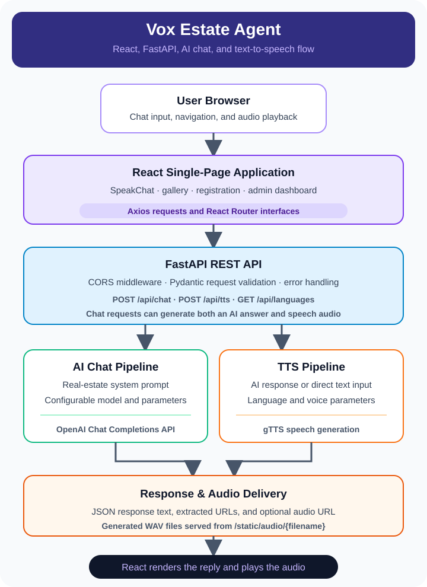

**Full-stack AI-powered real estate assistant** built with a **FastAPI** backend and **React** frontend, featuring **chat**, **text-to-speech (TTS)**, and **property management**.

# Vox Estate Agent

A full-stack AI-powered real estate assistant with Text-to-Speech (TTS), chat, and property management features. This project includes a FastAPI backend and a React frontend, designed for easy deployment and extensibility.

---

## Table of Contents
- [Project Overview](#project-overview)
- [Architecture](#architecture)
- [Backend (FastAPI)](#backend-fastapi)
  - [Features](#backend-features)
  - [Setup & Installation](#backend-setup--installation)
  - [API Endpoints](#backend-api-endpoints)
  - [Environment Variables](#backend-environment-variables)
  - [Running the Backend](#running-the-backend)
- [Frontend (React)](#frontend-react)
  - [Features](#frontend-features)
  - [Setup & Installation](#frontend-setup--installation)
  - [Running the Frontend](#running-the-frontend)
- [Deployment](#deployment)
- [License](#license)

---

## Project Overview
Vox Estate Agent is an AI-powered platform for real estate agents and clients. It provides:
- Natural language chat (OpenAI GPT)
- Text-to-Speech (TTS) audio responses
- Property management dashboard
- Admin tools and user authentication
- Modern, responsive frontend

---

## Architecture

<p align="center">
  
</p>

---

## Backend (FastAPI)
Location: `backend/realestate_agent`

### Backend Features
- FastAPI REST API with endpoints for chat, TTS, and language support
- AI chat powered by OpenAI GPT (configurable model)
- TTS using pyttsx3 (local) and gTTS (fallback)
- Audio files served from `/static/audio/`
- CORS configured for frontend integration
- Logging to file and console

### Backend Directory Structure
```
backend/
  realestate_agent/
    app/
      main.py           # FastAPI app entry point
      agent_pipeline.py # AI and TTS pipeline logic
      tts_service.py    # TTS engine (pyttsx3/gTTS)
    requirements.txt    # Python dependencies
    start_server.sh     # Quickstart script
    static/audio/       # Generated audio files
```

### Backend Setup & Installation
1. **Python 3.10+ recommended**
2. Create and activate a virtual environment:
   ```bash
   cd backend/realestate_agent
   python3 -m venv venv
   source venv/bin/activate
   ```
3. Install dependencies:
   ```bash
   pip install -r requirements.txt
   ```
4. Set up `.env` file with your OpenAI API key:
   ```env
   OPENAI_API_KEY=your-openai-key
   ```

### Backend API Endpoints
- `GET /` — Health check
- `POST /api/chat` — AI chat (input: text, options; output: response, audio, URLs)
- `POST /api/tts` — Text-to-Speech (input: text, language; output: audio_url)
- `GET /api/languages` — Supported TTS languages
- `GET /static/audio/{filename}` — Serve generated audio files

### Backend Environment Variables
- `OPENAI_API_KEY` — Required for AI chat
- Optional: configure other keys in `.env`

### Running the Backend
- Development:
  ```bash
  bash start_server.sh
  # or
  uvicorn app.main:app --host 0.0.0.0 --port 8000 --reload
  ```
- Production (recommended):
  - Use systemd or a process manager
  - Serve behind nginx for HTTPS and static files

---

## Frontend (React)
Location: `web-frontend/webfront`

### Frontend Features
- Modern React SPA (Create React App)
- Chat UI with TTS playback
- Admin dashboard, property management, user auth
- API integration with backend endpoints
- Responsive design and routing

### Frontend Directory Structure
```
web-frontend/webfront/
  src/
    App.js, SpeakChat.js, components/, pages/, utils/
  public/
    index.html, images, manifest.json
  package.json
  README.md
```

### Frontend Setup & Installation
1. **Node.js 18+ recommended**
2. Install dependencies:
   ```bash
   cd web-frontend/webfront
   npm install
   ```

### Running the Frontend
- Development:
  ```bash
  npm start
  # Runs at http://localhost:3000
  ```
- Production build:
  ```bash
  npm run build
  # Output in build/
  ```

### API Integration
- Frontend calls `/api/chat` and `/api/tts` (same-origin recommended for production)
- Audio files fetched from `/static/audio/{filename}`

---

## Deployment
- **Recommended:**
  - Deploy backend with systemd and nginx (see backend/start_server.sh)
  - Serve frontend build via nginx or static hosting
  - Configure nginx to proxy `/api/` to backend and serve `/static/audio/`
- **Environment:**
  - Set up `.env` for backend
  - Use HTTPS for production

---

## License
See LICENSE in each subproject for details.
